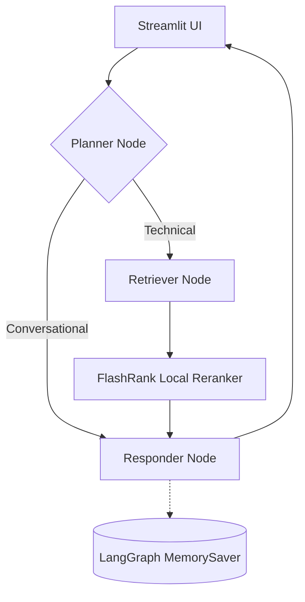

# Enterprise RAG System

An enterprise-grade, production-ready Retrieval-Augmented Generation (RAG) system built with LangGraph, Groq, Qdrant, and Google Cloud Platform.



---

## 📁 Project Structure

```text
app/
├── agents/            # LangGraph Nodes, State, and Graph compilation
├── config.py          # Centralized environment variable management
├── ingestion/         # End-to-end data processing (Loaders, Chunking)
├── main.py            # FastAPI application entrypoint
├── services/
│   ├── retrieval/     # Vector search (Qdrant), Embeddings (Vertex), Ranking (FlashRank)
│   └── storage/       # Postgres Checkpointers and Redis Cache
├── ui/                # Streamlit interface with source transparency & reasoning steps
├── DOCS/              # Comprehensive architectural and operational documentation
├── DATA/              # Sample datasets (True vs Noisy documentation)
├── Dockerfile         # Optimized production container definition
└── requirements.txt   # Locked dependencies for local and cloud parity
```

---

## 🏗️ Tech Stack

- **Orchestration**: LangChain & LangGraph
- **LLMs**: Groq (Llama 3.3 70B) for lightning-fast reasoning
- **Vector DB**: Qdrant (Cloud)
- **Cloud Platform**: Google Cloud Platform
  - **Compute**: Cloud Run (Serverless)
  - **Storage**: Cloud Storage (GCS)
  - **Database**: Cloud SQL (Postgres) & Redis
  - **AI Services**: Vertex AI (Embeddings), FlashRank (Local Reranking), Document AI
- **Observability**: Logfire (OpenTelemetry) & LangSmith

---

## 📚 Documentation Index

All detailed guides are located in the [DOCS/](DOCS/) folder:

1. **[System Overview](DOCS/01_system_overview.md)** - High-level vision and system flow.
2. **[Ingestion Engine](DOCS/02_ingestion_engine.md)** - How documents are parsed and indexed.
3. **[Node Intelligence](DOCS/03_node_intelligence.md)** - The "Brain" (Planner, Retriever, Responder).
4. **[Observability](DOCS/04_observability.md)** - Logfire and LangSmith tracing.
5. **[GCP Prod Setup](DOCS/05_gcp_prod_setup.md)** - Step-by-step infrastructure provisioning.
6. **[Deployment Strategy](DOCS/06_deployment_strategy.md)** - Cloud Build and Cloud Run details.
7. **[Env Variables](DOCS/07_env_variables.md)** - Complete configuration dictionary.
8. **[GCP Roles & Services](DOCS/08_gcp_roles_services.md)** - IAM and service breakdown.
9. **[Infra Architecture](DOCS/09_infra_architecture.md)** - The 3-tier cloud blueprint.
10. **[Known Gotchas](DOCS/10_known_gotchas.md)** - GCP quirks and architectural decisions.

---

## 🛠️ Getting Started

### 1. Clone & Install
```bash
git clone <repo-url>
cd enterprise-rag
python -m venv enterprise_env
# Activate virtual environment
# On Linux/macOS:
source enterprise_env/bin/activate
# On Windows:
enterprise_env\Scripts\activate

pip install -r requirements.txt
```

### 2. Environment Setup
Configure your environment variables in `.env` based on [`DOCS/07_env_variables.md`](DOCS/07_env_variables.md):
```bash
cp .env.example .env
```

### 3. Ingestion Pipeline
Index documents into Qdrant:
```bash
python -m app.ingestion.pipeline
```

### 4. Run Backend & UI
Run the FastAPI application:
```bash
uvicorn app.main:app --reload --port 8000
```

Run the Streamlit frontend:
```bash
streamlit run ui/app.py
```
