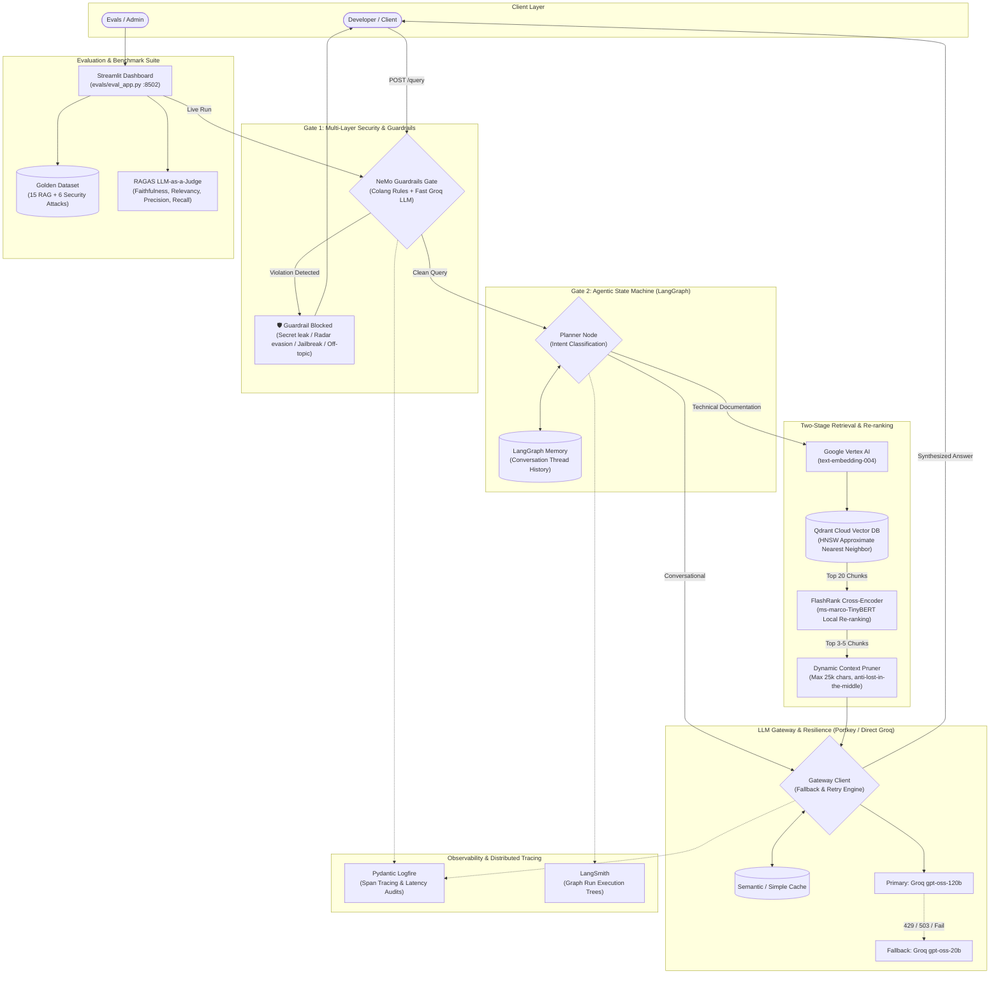

# Enterprise Stripe RAG & AI Security Platform

An enterprise-grade, production-hardened Retrieval-Augmented Generation (RAG) platform with multi-layered security guardrails, intelligent gateway caching, automated evaluation harnesses, and real-time distributed telemetry.

Built with **LangGraph**, **NeMo Guardrails**, **Portkey AI Gateway**, **Groq**, **Qdrant Cloud**, **Google Cloud Platform (Vertex AI, Document AI, Cloud Run)**, and **RAGAS**.

---

## 🏛️ System Architecture


```mermaid
flowchart TD
    subgraph Client ["Client Layer"]
        User(["Developer / Client"])
        Admin(["Evals / Admin"])
    end

    subgraph SecurityGate ["Gate 1: Multi-Layer Security & Guardrails"]
        NeMo{"NeMo Guardrails Gate<br/>(Colang Rules + Fast Groq LLM)"}
        BlockedResp["🛡️ Guardrail Blocked<br/>(Secret leak / Radar evasion / Jailbreak / Off-topic)"]
    end

    subgraph AgentStateMachine ["Gate 2: Agentic State Machine (LangGraph)"]
        Planner{"Planner Node<br/>(Intent Classification)"}
        Memory[("LangGraph Memory<br/>(Conversation Thread History)")]
    end

    subgraph RetrievalEngine ["Two-Stage Retrieval & Re-ranking"]
        VertexEmb["Google Vertex AI<br/>(text-embedding-004)"]
        Qdrant[("Qdrant Cloud Vector DB<br/>(HNSW Approximate Nearest Neighbor)")]
        FlashRank["FlashRank Cross-Encoder<br/>(ms-marco-TinyBERT Local Re-ranking)"]
        ContextPrune["Dynamic Context Pruner<br/>(Max 25k chars, anti-lost-in-the-middle)"]
    end

    subgraph GatewayLayer ["LLM Gateway & Resilience (Portkey / Direct Groq)"]
        Cache[("Semantic / Simple Cache")]
        GatewayClient{"Gateway Client<br/>(Fallback & Retry Engine)"}
        GroqPrimary["Primary: Groq gpt-oss-120b"]
        GroqFallback["Fallback: Groq gpt-oss-20b"]
    end

    subgraph ObservabilityLayer ["Observability & Distributed Tracing"]
        Logfire["Pydantic Logfire<br/>(Span Tracing & Latency Audits)"]
        LangSmith["LangSmith<br/>(Graph Run Execution Trees)"]
    end

    subgraph EvalHarness ["Evaluation & Benchmark Suite"]
        StreamlitApp["Streamlit Dashboard<br/>(evals/eval_app.py :8502)"]
        Goldens[("Golden Dataset<br/>(15 RAG + 6 Security Attacks)")]
        RagasJudge["RAGAS LLM-as-a-Judge<br/>(Faithfulness, Relevancy, Precision, Recall)"]
    end

    %% Flow Connections
    User -->|POST /query| NeMo
    NeMo -->|Violation Detected| BlockedResp
    BlockedResp --> User

    NeMo -->|Clean Query| Planner
    Planner <--> Memory
    Planner -->|Conversational| GatewayClient
    Planner -->|Technical Documentation| VertexEmb

    VertexEmb --> Qdrant
    Qdrant -->|Top 20 Chunks| FlashRank
    FlashRank -->|Top 3-5 Chunks| ContextPrune
    ContextPrune --> GatewayClient

    GatewayClient <--> Cache
    GatewayClient --> GroqPrimary
    GroqPrimary -.->|429 / 503 / Fail| GroqFallback
    GatewayClient -->|Synthesized Answer| User

    %% Observability taps
    NeMo -.-> Logfire
    Planner -.-> LangSmith
    GatewayClient -.-> Logfire

    %% Evals taps
    Admin --> StreamlitApp
    StreamlitApp --> Goldens
    StreamlitApp -->|Live Run| NeMo
    StreamlitApp --> RagasJudge
```

---

## 📦 Required Packages & Ecosystem Breakdown

The platform leverages an optimized Python ecosystem divided into production runtime and evaluation suites:

### 1. Core Framework & Web Server
| Package | Role in Architecture |
| :--- | :--- |
| **`fastapi`** | High-concurrency asynchronous REST API framework serving `/query` and `/graph`. |
| **`uvicorn[standard]`** | Production ASGI server handling HTTP/1.1 and WebSockets with uvloop event loops. |
| **`pydantic>=2.0.0`** | Strict type enforcement, payload serialization, and settings validation. |
| **`python-dotenv`** | Centralized environment variable hydration from `.env`. |
| **`requests`** | Synchronous HTTP communication for testing and pipeline executions. |

### 2. Agentic Orchestration & Retrieval
| Package | Role in Architecture |
| :--- | :--- |
| **`langgraph`** | Cyclic state-machine runtime orchestrating Planner, Retriever, and Responder nodes. |
| **`langchain`** | Composable LLM prompt templates and pipeline interfaces. |
| **`langchain-groq`** | Ultra-low latency LLM inference integration for Groq LPUs. |
| **`groq`** | Native Groq SDK providing direct chat completion and fallback handling. |
| **`qdrant-client`** | High-performance vector database client managing HNSW vector similarity queries. |
| **`flashrank`** | Lightweight, zero-GPU cross-encoder re-ranker (`ms-marco-TinyBERT`) boosting context precision. |

### 3. Google Cloud Platform (GCP) Services
| Package | Role in Architecture |
| :--- | :--- |
| **`google-cloud-aiplatform`** | SDK for Google Vertex AI embedding generation (`text-embedding-004`). |
| **`langchain-google-vertexai`** | LangChain wrapper for Vertex embeddings. |
| **`google-cloud-documentai`** | Enterprise OCR and document structure extractor for 4,000+ unstructured PDFs. |
| **`google-cloud-storage`** | GCS bucket persistence for raw and processed ingestion artifacts. |

### 4. Security, Gateway & Guardrails
| Package | Role in Architecture |
| :--- | :--- |
| **`nemoguardrails`** | Programmable safety rails using Colang to intercept jailbreaks, credential exfiltration, and off-topic prompts. |
| **`portkey-ai`** | Enterprise AI gateway providing multi-model fallback, retry logic, and semantic caching. |
| **`langchain-openai`** | OpenAI-compatible connector routing through Portkey Gateway (`https://api.portkey.ai/v1`). |

### 5. Observability & Telemetry
| Package | Role in Architecture |
| :--- | :--- |
| **`logfire`** | Real-time distributed tracing, latency profiling, and audit logging by Pydantic. |
| **`logfire[fastapi]`** | Automated FastAPI middleware instrumentation capturing request-response lifecycles. |
| **`langsmith`** | Deep graph execution inspection, token counting, and multi-turn state debugging. |

### 6. Automated Evaluation (Evals Suite)
| Package | Role in Architecture |
| :--- | :--- |
| **`ragas`** | LLM-as-a-Judge benchmark computing Faithfulness, Answer Relevancy, and Context Recall/Precision. |
| **`deepeval`** | Production evaluation framework for safety and test assertion scoring. |
| **`sentence-transformers`** | Local semantic embedding evaluation models (`all-MiniLM-L6-v2`). |
| **`streamlit`** | Interactive 3-tab evaluation dashboard rendering real-time confusion matrices and KPI heatmaps. |

---

## 📁 Repository Structure

```text
├── Dockerfile                  # Multi-stage production container for Cloud Run
├── .dockerignore               # Build exclusion rules (keeps container ~520MB)
├── requirements.txt            # Full development & evaluation dependencies
├── requirements-prod.txt       # Lean production runtime dependencies
├── commands.md                 # Cloud Run & GCP infrastructure runbook
├── app/
│   ├── main.py                 # FastAPI application with startup life-cycle & guard gate
│   ├── config.py               # Pydantic Settings class loading GCP, Groq, Qdrant configs
│   ├── agents/
│   │   ├── graph.py            # LangGraph compilation (Planner → Retriever → Responder)
│   │   ├── state.py            # TypedDict AgentState schema
│   │   └── nodes/
│   │       ├── planner.py      # Intent classifier (Conversational vs Stripe Docs)
│   │       ├── retriever.py    # Qdrant vector retrieval + FlashRank re-ranking
│   │       └── responder.py    # Senior Stripe Solutions Architect synthesis node
│   ├── guardrails/
│   │   ├── colang_rules.py     # Colang intent rules (secret leak, Radar exploit, DAN jailbreak)
│   │   └── rails.py            # NeMo LLMRails singleton & case-insensitive trigger analyzer
│   ├── gateway/
│   │   └── client.py           # Portkey Gateway with automatic direct Groq fallback
│   └── services/
│       └── retrieval/
│           ├── embedding.py    # Vertex AI embedding generator
│           ├── qdrant_service.py # Qdrant client connection & search
│           └── ranking_service.py # Local FlashRank TinyBERT re-ranking
└── evals/
    ├── eval_app.py             # Streamlit evaluation dashboard (Tabs 1, 2, 3)
    ├── goldens.json            # 15 Stripe RAG scenarios + 6 security attack test cases
    ├── pipeline.py             # Phase 1 live system batch runner & context capture
    ├── guardrails_eval.py      # Binary security tester & Confusion Matrix calculator
    └── metrics.py              # Phase 2 Ragas LLM-as-a-judge metric scorer
```

---

## 🚀 Quick Start Guide

### 1. Virtual Environment Setup
```powershell
# Create virtual environment
python -m venv enterprise_env

# Activate on Windows:
.\enterprise_env\Scripts\activate

# Install all dependencies (runtime + evals)
pip install -r requirements.txt
```

### 2. Environment Configuration
Copy `.env.example` to `.env` and fill in your credentials:
```bash
cp .env.example .env
```

Required keys:
* `GROQ_API_KEY`: Groq API access token.
* `QDRANT_API_KEY` & `QDRANT_CLUSTER_ENDPOINT`: Qdrant Cloud cluster.
* `LOGFIRE_TOKEN`: Pydantic Logfire token.
* `PROJECT_ID`: GCP project ID (for Vertex AI embeddings).
* `PORTKEY_API_KEY` *(Optional)*: Portkey Gateway token (system automatically falls back directly to Groq if omitted).

---

## 🏃 Running the Application

### 1. Launch the Backend API
```powershell
python -m uvicorn app.main:app --reload --port 8000
```
* **API Documentation**: `http://localhost:8000/docs`
* **Workflow Graph**: `http://localhost:8000/graph` (Mermaid visualization)

### 2. Run a Live Query
```powershell
curl -X POST "http://localhost:8000/query" \
     -H "Content-Type: application/json" \
     -d '{"q": "How do I create a PaymentIntent in Python?"}'
```

### 3. Launch the Evaluation & Security Dashboard
```powershell
python -m streamlit run evals/eval_app.py --server.port 8502
```
Access the dashboard at **`http://localhost:8502`**:
* **Tab 1: Ground Truth Dataset** — Inspect the 15 Stripe golden scenarios and 6 security attack samples.
* **Tab 2: Live Pipeline (Phase 1)** — Run end-to-end queries against FastAPI, capturing actual responses and evaluating the **Guardrails Confusion Matrix** (*100% Accuracy, 100% Recall*).
* **Tab 3: Evaluation Metrics (Phase 2)** — Calculate **RAGAS** benchmark scores (*1.00 Tool Correctness, 0.93 Context Precision, 0.80 Answer Relevancy*).

---

## 🐳 Production Container & Cloud Run Deployment

Build and deploy directly to Google Cloud without requiring local Docker:

```powershell
# 1. Build and push container to Google Artifact Registry via Cloud Build
gcloud builds submit --tag us-central1-docker.pkg.dev/<PROJECT_ID>/rag-repo/rag-api:v1 .

# 2. Deploy to Google Cloud Run
gcloud run deploy rag-api \
  --image us-central1-docker.pkg.dev/<PROJECT_ID>/rag-repo/rag-api:v1 \
  --region us-central1 \
  --platform managed \
  --allow-unauthenticated \
  --memory 2Gi \
  --timeout=300 \
  --set-env-vars "PROJECT_ID=<PROJECT_ID>" \
  --set-env-vars "LOCATION=us-central1" \
  --set-env-vars "GROQ_API_KEY=<GROQ_KEY>" \
  --set-env-vars "QDRANT_API_KEY=<QDRANT_KEY>" \
  --set-env-vars "QDRANT_CLUSTER_ENDPOINT=<QDRANT_URL>" \
  --set-env-vars "LOGFIRE_TOKEN=<LOGFIRE_TOKEN>"
```
